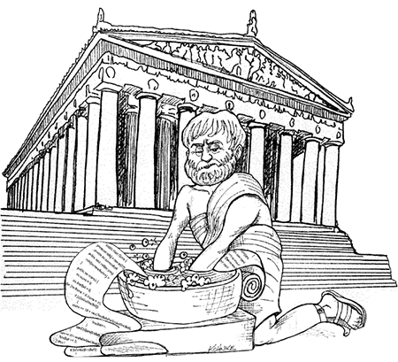

# Código Limpo - PHP

Um guia não tão `quick reference` com exemplos retirados do próprio livro convertido em PHP.

## Introdução

 Esse repositorio se destina a um estudo pessoal do livro **Clean Code: A Handbook of Agile Software Craftsmanship**, convertendo seus exemplos e metodologia para o PHP, a fim de praticar e fixar os exercicios.

  > Há duas vertentes para se obter habilidade profissional: conhecimento e trabalho.

## Índice

 1. [Nomes Significativos](./capitulo/1-nomes-significativos.md)
 1. Funções
 1. Comentários
 1. Formatação
 1. Objetos e Estrutura de Dados
 1. Tratamento de Erro
 1. Limites
 1. Teste de Unidade
 1. Classes

